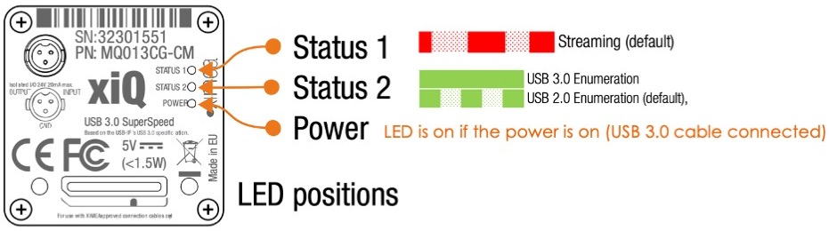

# Ximea Camera ROS2 Driver

This repo aims provides a generic [ROS2](https://docs.ros.org/en/foxy/index.html) driver for the XIMEA -- MQ022CG-CM camera. The repo was adapted from [wavelab's](https://github.com/wavelab/ximea_ros_cam) ROS1 version. And so credit is given to this version for much of the code and convention in this driver. 



<hr/> 

## Prerequisites

### ROS2

- Tested on [ROS2 foxy](https://docs.ros.org/en/foxy/Installation.html)

- Using [eCAL RWM](https://github.com/eclipse-ecal/rmw_ecal) as an alternative to ROS2 DDS implementations showed significant perfomance improvements
  
### Ximea SDK

Installed and tested on Ubuntu 20.04 LTS.

<b> OPTIONAL: </b>For full installation and setup, you could simply run the bash script: [ximea_install.sh](ximea_ros2_cam/docs/installation/ximea_install.sh). Make sure you have the limits.txt file in the same directory. Also checkout the [docker file](docs/docker/XIMEA.Dockerfile) for possible use with ROS2 Humble using the [nvidia-isaac-ros](https://github.com/NVIDIA-ISAAC-ROS/isaac_ros_common) docker workspace.

Download and extract the most recent software package:
```bash
cd ~; mkdir tmp; cd tmp
wget https://www.ximea.com/downloads/recent/XIMEA_Linux_SP.tgz
```
```bash
tar xzf XIMEA_Linux_SP.tgz
cd package
```
Install the package depending on you camera type
```bash
./install -<type>
```
types:

    -cam_usb30
    -pcie

#### Add user to the pugdev group:
```bash
sudo gpasswd -a $USER plugdev
```
#### Set the USB FS memory allocation to infinite for sufficient buffering size for high bandwith USB3.0 streams:
```bash
echo 0 > /sys/module/usbcore/parameters/usbfs_memory_mb
# You can put this line to your bashrc file to apply to every new shell
```
#### set realtime priority by putting the following to ``` /etc/security/limits.conf ```:
```bash
*               -       rtprio          0
@realtime       -       rtprio          81
*               -       nice            0
@realtime       -       nice            -16
```
then add the user to realtime
```bash
sudo groupadd realtime #if it doesn't exist yet
sudo gpasswd -a $USER realtime
```
You may need to reboot your system for some changes to take effect.

## Running the ros package

clone this repo to your ros2 workspace source directory:
```bash
git clone <somelink>
```
Modify camera parameters as desired in the [config](config/xiCam_config.yaml) and [launch](launch/xiCam.launch.xml) files, and run the node using the provided launch file or a custom. 

<b>NOTE:</b> Ximea API's demosaic color defect correction is not optimized for ARM processors, and so performance may degrade significantly. To avoid this you can instead capture raw 8-bits or 16-bits images (by setting the <i>format</i> parameter to <b>RAW8</b> or <b>RAW16</b> in the config file) and post-process later using the API's [offline processing](https://www.ximea.com/support/wiki/apis/XiAPI_Offline_Processing).
